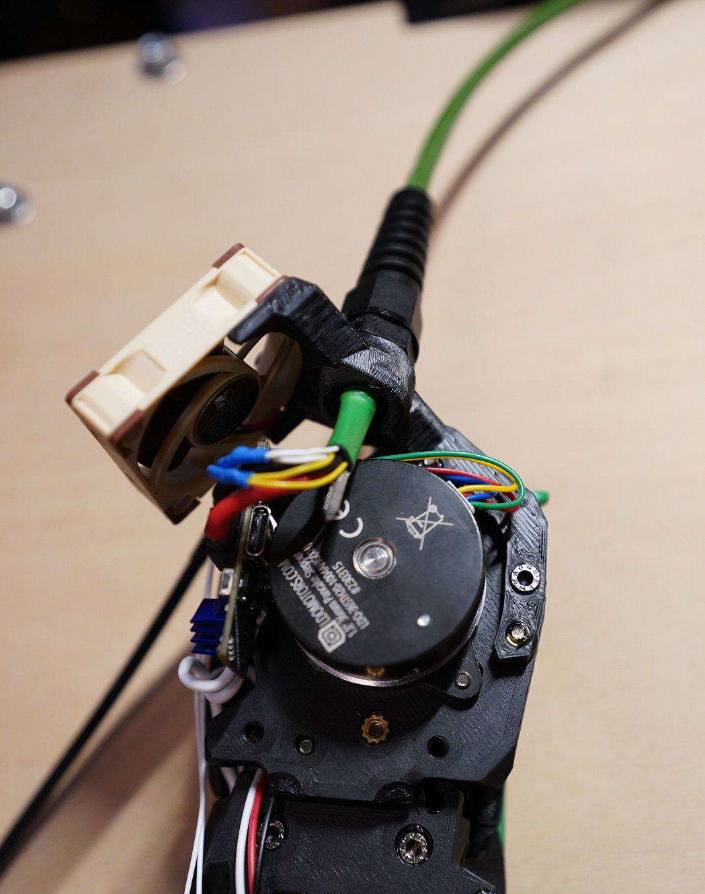
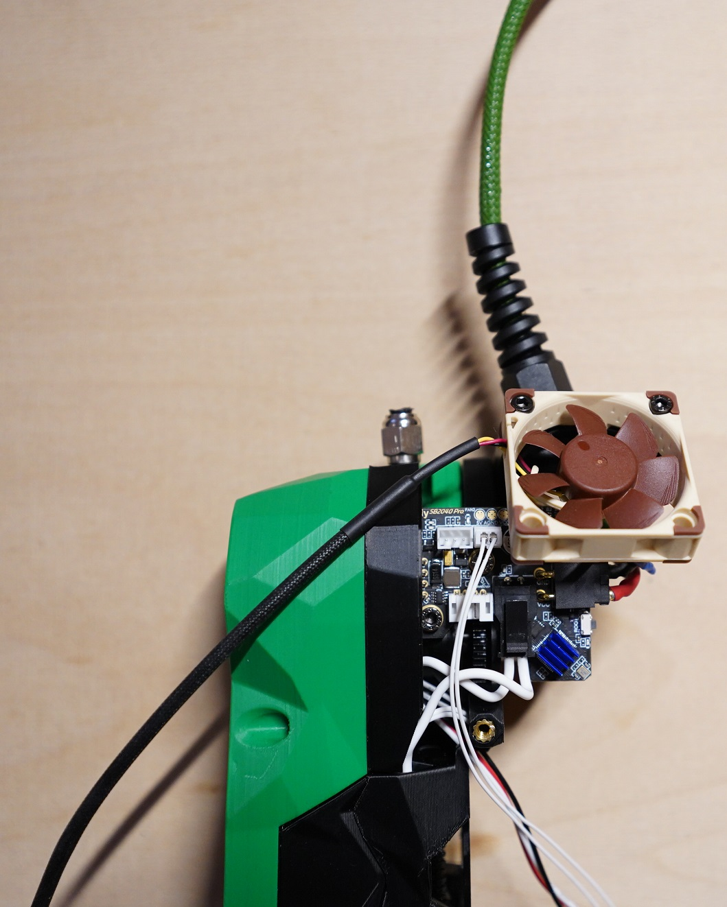
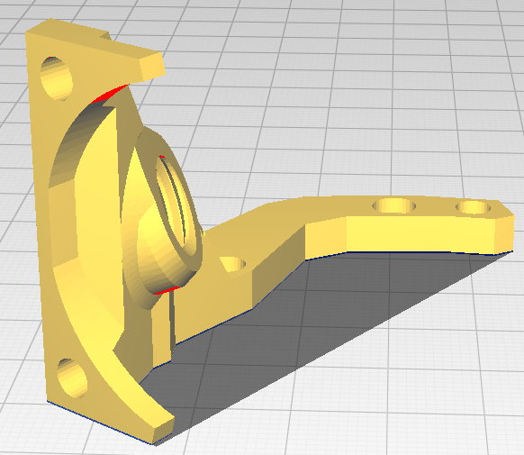
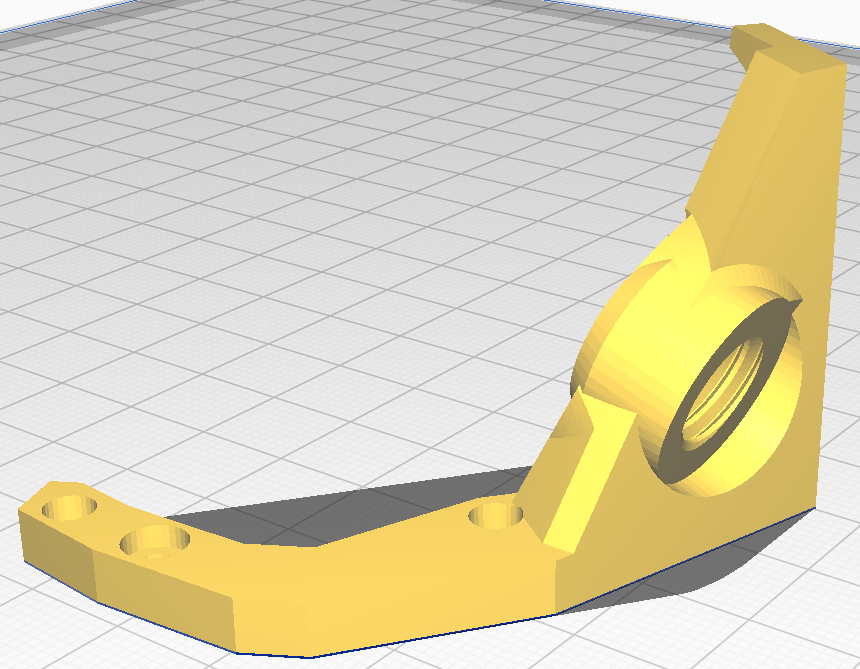

# stealthburner-canbus-cable-holder

 

Voron Stealthburner canbus cable holder with 20 degree angle to filament tube. With 40mm fan holder.

BOM:
4x M3 heat insert
2x M3x8 screw
3x M3x16 screw

